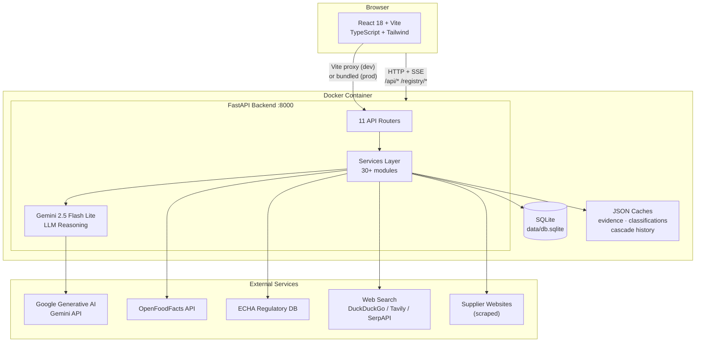

Google Drive: https://drive.google.com/drive/folders/12f9w-at7ATn9lE_qTII1d3ehcfLkXlkU?usp=drive_link

# Agnes — AI Supply Chain Manager Extension
CPG Ingredient Consolidation & Substitution Intelligence

## Overview

Agnes is an AI-native supply chain manager for CPG supplement companies. It connects raw-material suppliers with supplement manufacturers across three core workflows:

- **Batching** — minimise the number of suppliers needed to fulfil a product's full ingredient list
- **Compliance checking** — validate raw materials against supplier evidence and food regulations
- **Alternative finding** — detect functionally equivalent ingredient substitutions across companies

## System Architecture



## Cascade Orchestration

A full Agnes cascade is triggered via `POST /registry/trigger` and runs 12 sequential steps, streaming live events to the frontend via SSE:

1. **Init** — load all companies, BOMs, suppliers; register agents in-memory
2. **Demand Analysis** — aggregate cross-company raw material demand
3. **Substitution Graph** — find alternative raw materials; per-candidate compliance checked via Gemini against EU 1169/2011, EU 1333/2008, EU 2018/848, EU 1829/2003
4. **Enrichment** — enrich candidates via OpenFoodFacts, ECHA, and web search
5. **Compliance** — filter substitution candidates by compliance status (approved / needs review / rejected)
6. **Consolidation** — group SKUs by optimal supplier, minimise supplier count
7. **Tradeoffs** — cost / lead-time / compliance balance via Gemini synthesis
8. **Evidence** — compile attribution trails (supplier · web · regulatory · LLM)
9. **Reputation** — evolve trust scores in the supplier ledger
10. **Reporting** — dashboard data, recommendations, risk alerts
11. **Discovery** — agent-based supplier search via Agent Protocol HTTP transport
12. **Intelligence** — generate ESG / risk / policy signals

Each step emits `LiveMessage` events to `/api/stream`. Cascade reports are persisted to `data/cascade_history.json`. If trust/risk thresholds are exceeded, the cascade pauses and waits for human response via `POST /api/escalation/respond`.

## Batching

The batching feature is accessible directly from the Sourcing UI without running a full cascade.

- Select any finished good from the product dropdown
- Set per-ingredient constraints (cost floor/ceiling, min purity, min quality score)
- Agnes runs a greedy set-cover algorithm and returns multiple ranked supplier combinations
- Each alternative shows supplier count, coverage %, estimated cost, and quality score
- Deltas vs the recommended option are shown for each alternative
- Constraints can be exported/imported as CSV

## Compliance Checker

The standalone compliance checker (`backend/service_compliance_checker/`) evaluates raw materials for a finished product:

1. Load raw-material BOM components from the database
2. Identify all suppliers linked to each raw material
3. Normalize SKU names into readable ingredient names
4. Check each supplier against a predefined allowlist (8 suppliers with known official domains)
5. Scrape only the allowlisted supplier pages for evidence
6. Extract evidence terms: allergens, animal/plant origin, quality certifications, warning terms
7. Return per-ingredient status: `VALID_RAW_MATERIAL`, `RISKY_RAW_MATERIAL`, or `INSUFFICIENT_EVIDENCE`

Allowlisted suppliers: BulkSupplements, Capsuline, Custom Probiotics, FeedsForLess, PureBulk, Source-Omega, Spectrum Chemical, Trace Minerals.

## Database

SQLite at `data/db.sqlite`:

| Entity | Count |
|---|---|
| Companies | 61 |
| Suppliers | 40 |
| Raw materials | 876 |
| Finished goods | 149 |
| BOMs | 149 |
| Supplier–product links | 1,633 |

Schema: `Company`, `Product` (type: `finished-good` / `raw-material`), `BOM`, `BOM_Component`, `Supplier`, `Supplier_Product`.

## Agent Protocols

Agnes supports three transport protocols for inter-agent communication:

- **HTTP/JSON** — default agent protocol (`POST /agent/{agent_id}`)
- **MCP (JSON-RPC 2.0)** — tool definitions via `POST /mcp/{agent_id}`; methods: `tools/list`, `tools/call`
- **A2A (Google Agent-to-Agent)** — agent cards + task lifecycle via `GET /a2a/{agent_id}/agent-card` and `POST /a2a/{agent_id}`

## API Endpoints

### Sourcing
| Method | Path | Description |
|---|---|---|
| `GET` | `/api/sourcing/boms` | List all BOMs |
| `GET` | `/api/sourcing/bom/{sku}` | BOM components + stats for a SKU |
| `POST` | `/api/sourcing/batch` | Run batching with optional constraints |
| `GET` | `/api/sourcing/analyze/{finished_good_id}` | Full sourcing analysis |

### Compliance
| Method | Path | Description |
|---|---|---|
| `GET` | `/api/compliance/{product_id}` | Run compliance check for a product |

### Catalogue & Data
| Method | Path | Description |
|---|---|---|
| `GET` | `/api/catalogue` | Product catalogue |
| `GET` | `/api/finished-goods` | All finished goods |
| `GET` | `/api/companies` | All companies |
| `GET` | `/api/boms` | All BOMs |
| `GET` | `/api/boms/{product_id}` | BOM for a product |
| `GET` | `/api/raw-materials` | Raw materials with supplier mappings |
| `GET` | `/api/suppliers` | Supplier list |

### Cascade
| Method | Path | Description |
|---|---|---|
| `POST` | `/registry/trigger` | Start a cascade |
| `GET` | `/api/stream` | SSE live message feed |
| `GET` | `/api/progress` | Cascade progress |
| `GET` | `/api/report` | Latest cascade report |
| `GET` | `/api/substitutions` | Latest substitution graph |
| `GET` | `/api/proposal` | Latest consolidation proposal |
| `GET` | `/api/demand` | Cross-company ingredient demand |
| `GET` | `/api/evidence` | Evidence store |
| `GET` | `/api/cascades` | Past cascade summaries |
| `GET` | `/api/cascades/{report_id}` | Report by ID |

### Trust & Reputation
| Method | Path | Description |
|---|---|---|
| `POST` | `/api/trust/submit` | Submit trust signal |
| `GET` | `/api/trust/contextual/{agent_id}` | Contextual trust for agent |
| `GET` | `/api/reputation/summary` | Reputation summary |
| `GET` | `/api/reputation/scores` | All reputation scores |

## Repository Structure

```
backend/
  ├─ main.py                     FastAPI app, router registration
  ├─ db.py                       Core SQLite data layer (batch, check_compliance)
  ├─ agents/                     LLM agents (suppliers, compliance, logistics, MCP, A2A)
  ├─ services/
  │   ├─ cascade_service.py      12-step cascade orchestrator
  │   ├─ cascade_steps/          One module per cascade step
  │   ├─ sourcing/               Batching pipeline, supplier registry, subagents
  │   └─ retrieval/              OpenFoodFacts, ECHA, web search, supplier scraping
  ├─ controllers/                FastAPI route handlers (13 routers)
  ├─ adapters/                   MCP, A2A, OpenAI client adapters
  └─ service_compliance_checker/ Standalone raw-material compliance service

frontend/
  ├─ src/pages/Sourcing.tsx      Batching UI with constraint editor
  ├─ src/pages/AnalysisView.tsx  Cascade analysis view
  ├─ src/components/             ComplianceDialog, EvidencePanel, VariantCard, ...
  └─ src/api/client.ts           API client

sourcing/pipeline/               Data enrichment scripts
  ├─ scrape_suppliers.py         Scrapes supplier product pages
  ├─ text2product.py             Gemini extraction (prices, purity, quality metrics)
  ├─ filter_products.py          Composable filters (price, purity, quality score)
  └─ evaluate.py                 LLM-as-judge evaluation

diagrams/                        Mermaid architecture diagrams (8 diagrams)
data/db.sqlite                   SQLite database
```

## Requirements

- Python 3.14
- Node.js 20+
- Docker (optional)

## Environment Variables

Create a `.env` in the repo root:

```
GEMINI_API_KEY=...           # Required — Gemini 2.5 Flash Lite
SQLITE_DB_PATH=data/db.sqlite
```

Optional:
```
SERVE_FRONTEND=true                    # Serve built frontend from backend
VITE_API_BASE_URL=http://localhost:8000
AGENT_PROTOCOL_SECRET=...              # HMAC-SHA256 signing for agent protocol messages
ENABLE_EXTERNAL_AGENT_TRANSPORT=true   # Send protocol messages over HTTP
ENABLE_EXTERNAL_ENRICHMENT=true        # Enrich via OpenFoodFacts/ECHA (default: true)
WEB_SEARCH_PROVIDER=duckduckgo         # duckduckgo | tavily | serpapi
TAVILY_API_KEY=...                     # Required if WEB_SEARCH_PROVIDER=tavily
```

## Local Development

```bash
# Backend + frontend (starts both)
python run.py
# Backend: http://localhost:8000
# Frontend: http://localhost:5173

# Frontend only
cd frontend && npm install && npm run dev

# Backend only
pip install -r backend/requirements.txt
uvicorn backend.main:app --reload
```

## Docker

```bash
docker build -t agnes .
docker run --rm -e PORT=8080 -e SERVE_FRONTEND=true \
  -e GEMINI_API_KEY=YOUR_KEY -p 8080:8080 agnes
# http://localhost:8080
```
