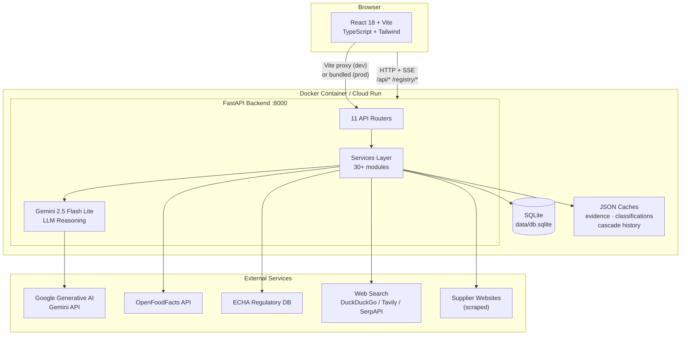

# System Overview

```mermaid
graph TB
    subgraph Browser["Browser"]
        FE["React 18 + Vite\nTypeScript + Tailwind"]
    end

    subgraph Docker["Docker Container / Cloud Run"]
        subgraph Backend["FastAPI Backend :8000"]
            API["11 API Routers"]
            SVC["Services Layer\n30+ modules"]
            LLM["Gemini 2.5 Flash Lite\nLLM Reasoning"]
        end
        DB[("SQLite\ndata/db.sqlite")]
        CACHE["JSON Caches\nevidence · classifications\ncascade history"]
    end

    subgraph External["External Services"]
        GEMINI["Google Generative AI\nGemini API"]
        OFF["OpenFoodFacts API"]
        ECHA["ECHA Regulatory DB"]
        WEB["Web Search\nDuckDuckGo / Tavily / SerpAPI"]
        SUPPLIER["Supplier Websites\n(scraped)"]
    end

    Browser -- "HTTP + SSE\n/api/* /registry/*" --> Backend
    FE -- "Vite proxy (dev)\nor bundled (prod)" --> API
    API --> SVC
    SVC --> DB
    SVC --> CACHE
    SVC --> LLM
    LLM --> GEMINI
    SVC --> OFF
    SVC --> ECHA
    SVC --> WEB
    SVC --> SUPPLIER
```