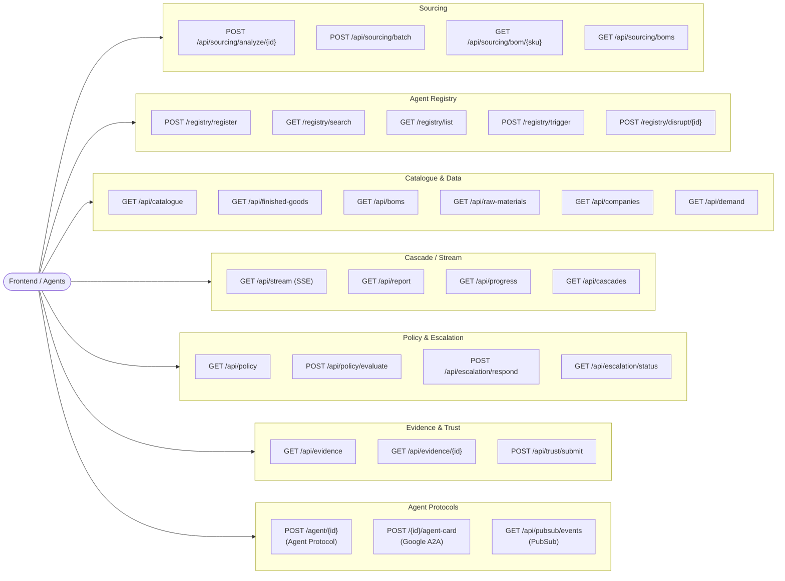

# Backend API Routes

```mermaid
graph LR
    subgraph Sourcing["Sourcing"]
        S1["POST /api/sourcing/analyze/{id}"]
        S2["POST /api/sourcing/batch"]
        S3["GET  /api/sourcing/bom/{sku}"]
        S4["GET  /api/sourcing/boms"]
    end

    subgraph Registry["Agent Registry"]
        R1["POST /registry/register"]
        R2["GET  /registry/search"]
        R3["GET  /registry/list"]
        R4["POST /registry/trigger"]
        R5["POST /registry/disrupt/{id}"]
    end

    subgraph Catalogue["Catalogue & Data"]
        C1["GET /api/catalogue"]
        C2["GET /api/finished-goods"]
        C3["GET /api/boms"]
        C4["GET /api/raw-materials"]
        C5["GET /api/companies"]
        C6["GET /api/demand"]
    end

    subgraph Stream["Cascade / Stream"]
        ST1["GET  /api/stream (SSE)"]
        ST2["GET  /api/report"]
        ST3["GET  /api/progress"]
        ST4["GET  /api/cascades"]
    end

    subgraph Policy["Policy & Escalation"]
        P1["GET  /api/policy"]
        P2["POST /api/policy/evaluate"]
        E1["POST /api/escalation/respond"]
        E2["GET  /api/escalation/status"]
    end

    subgraph Evidence["Evidence & Trust"]
        EV1["GET  /api/evidence"]
        EV2["GET  /api/evidence/{id}"]
        T1["POST /api/trust/submit"]
    end

    subgraph AgentProto["Agent Protocols"]
        AP1["POST /agent/{id}\n(Agent Protocol)"]
        AP2["POST /{id}/agent-card\n(Google A2A)"]
        AP3["GET  /api/pubsub/events\n(PubSub)"]
    end

    Client(["Frontend / Agents"]) --> Sourcing
    Client --> Registry
    Client --> Catalogue
    Client --> Stream
    Client --> Policy
    Client --> Evidence
    Client --> AgentProto
```