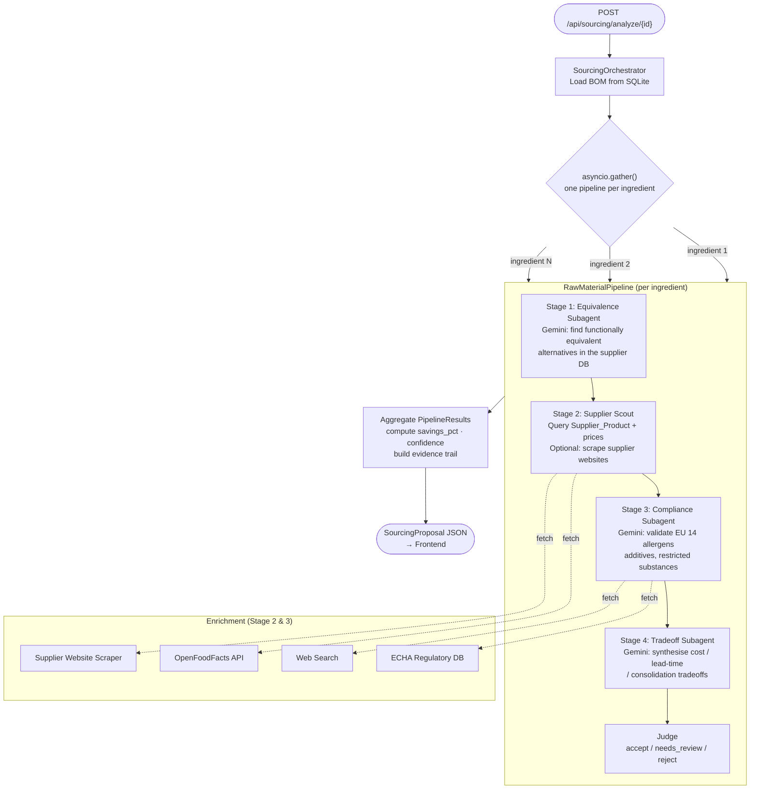
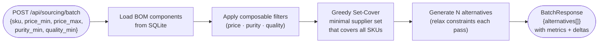

# Sourcing Analysis Pipeline

```mermaid
flowchart TD
    START(["POST /api/sourcing/analyze/{id}"])
    ORCH["SourcingOrchestrator\nLoad BOM from SQLite"]
    FANOUT{"asyncio.gather()\none pipeline per ingredient"}

    START --> ORCH --> FANOUT

    subgraph Pipeline["RawMaterialPipeline (per ingredient)"]
        direction TB
        EQ["Stage 1: Equivalence Subagent\nGemini: find functionally equivalent\nalternatives in the supplier DB"]
        SC["Stage 2: Supplier Scout\nQuery Supplier_Product + prices\nOptional: scrape supplier websites"]
        CO["Stage 3: Compliance Subagent\nGemini: validate EU 14 allergens\nadditives, restricted substances"]
        TR["Stage 4: Tradeoff Subagent\nGemini: synthesise cost / lead-time\n/ consolidation tradeoffs"]
        JD["Judge\naccept / needs_review / reject"]

        EQ --> SC --> CO --> TR --> JD
    end

    FANOUT -->|ingredient 1| Pipeline
    FANOUT -->|ingredient 2| Pipeline
    FANOUT -->|ingredient N| Pipeline

    AGG["Aggregate PipelineResults\ncompute savings_pct · confidence\nbuild evidence trail"]
    RESP(["SourcingProposal JSON\n→ Frontend"])

    Pipeline --> AGG --> RESP

    subgraph Enrichment["Enrichment (Stage 2 & 3)"]
        OFF2["OpenFoodFacts API"]
        ECHA2["ECHA Regulatory DB"]
        WEB2["Web Search"]
        SCRAPE["Supplier Website Scraper"]
    end

    SC -.->|fetch| OFF2
    CO -.->|fetch| ECHA2
    CO -.->|fetch| WEB2
    SC -.->|fetch| SCRAPE
```

## Greedy Batch Endpoint

```mermaid
flowchart LR
    REQ(["POST /api/sourcing/batch\n{sku, price_min, price_max,\n purity_min, quality_min}"])
    BOM2["Load BOM components\nfrom SQLite"]
    FILT["Apply composable filters\n(price · purity · quality)"]
    COVER["Greedy Set-Cover\nminimal supplier set\nthat covers all SKUs"]
    ALTS["Generate N alternatives\n(relax constraints each pass)"]
    RESP2(["BatchResponse\n{alternatives[]}\nwith metrics + deltas"])

    REQ --> BOM2 --> FILT --> COVER --> ALTS --> RESP2
```