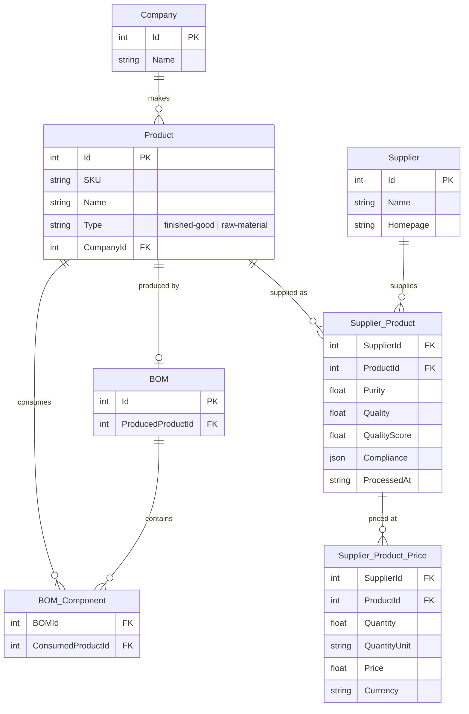

# Database Schema (SQLite)

## File-Based Caches

| File | Contents | TTL |
|------|----------|-----|
| `data/evidence_cache.json` | Supplier evidence fetched during pipeline runs | TTL-based |
| `data/rm_classification.json` | Raw-material functional category classification | Persistent |
| `cascade_history.json` | Full past cascade reports | Persistent |
| Browser `localStorage` | Analysis results, user variant selections | Persistent |