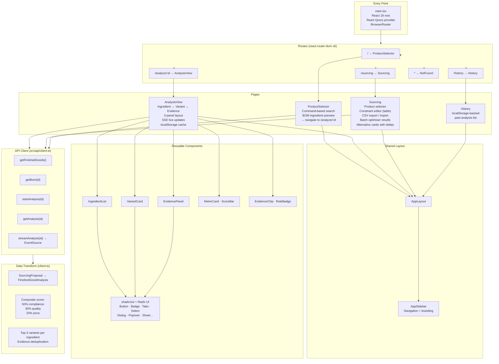
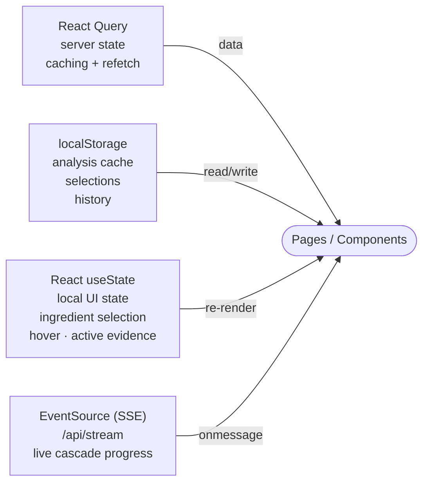

# Frontend Architecture

```mermaid
graph TB
    subgraph Entry["Entry Point"]
        MAIN["main.tsx\nReact 18 root\nReact Query provider\nBrowserRouter"]
    end

    subgraph Router["Routes (react-router-dom v6)"]
        R1["/ → ProductSelector"]
        R2["/analyze/:id → AnalysisView"]
        R3["/sourcing → Sourcing"]
        R4["/history → History"]
        R5["* → NotFound"]
    end

    subgraph Pages["Pages"]
        PS["ProductSelector\nCommand-based search\nBOM ingredient preview\n→ navigate to /analyze/:id"]
        AV["AnalysisView\nIngredient ↔ Variant ↔ Evidence\n3-panel layout\nSSE live updates\nlocalStorage cache"]
        SO["Sourcing\nProduct selector\nConstraint editor (table)\nCSV export / import\nBatch optimiser results\nAlternative cards with deltas"]
        HI["History\nlocalStorage-backed\npast analysis list"]
    end

    subgraph Layout["Shared Layout"]
        AL["AppLayout"]
        AS["AppSidebar\nNavigation + branding"]
    end

    subgraph Components["Reusable Components"]
        IL["IngredientList"]
        VC["VariantCard"]
        EP["EvidencePanel"]
        MC["MetricCard · ScoreBar"]
        EC["EvidenceChip · RoleBadge"]
        UI["shadcn/ui + Radix UI\nButton · Badge · Tabs · Select\nDialog · Popover · Sheet…"]
    end

    subgraph APIClient["API Client (src/api/client.ts)"]
        AC1["getFinishedGoods()"]
        AC2["getBom(id)"]
        AC3["startAnalysis(id)"]
        AC4["getAnalysis(id)"]
        AC5["streamAnalysis(id) → EventSource"]
    end

    subgraph Transform["Data Transform (client.ts)"]
        T1["SourcingProposal → FinishedGoodAnalysis"]
        T2["Composite score:\n50% compliance\n30% quality\n20% price"]
        T3["Top-3 variants per ingredient\nEvidence deduplication"]
    end

    MAIN --> Router
    Router --> R1 & R2 & R3 & R4 & R5
    R1 --> PS
    R2 --> AV
    R3 --> SO
    R4 --> HI

    PS & AV & SO & HI --> AL
    AL --> AS

    AV --> IL & VC & EP
    AV --> MC & EC

    IL & VC & EP --> UI

    AV --> APIClient
    SO --> APIClient
    PS --> APIClient

    APIClient --> Transform
```

## State Management

```mermaid
graph LR
    RQ["React Query\nserver state\ncaching + refetch"]
    LS["localStorage\nanalysis cache\nselections\nhistory"]
    RS["React useState\nlocal UI state\ningredient selection\nhover · active evidence"]
    SSE["EventSource (SSE)\n/api/stream\nlive cascade progress"]

    RQ -->|data| Pages
    LS -->|read/write| Pages
    RS -->|re-render| Pages
    SSE -->|onmessage| Pages

    Pages(["Pages / Components"])
```