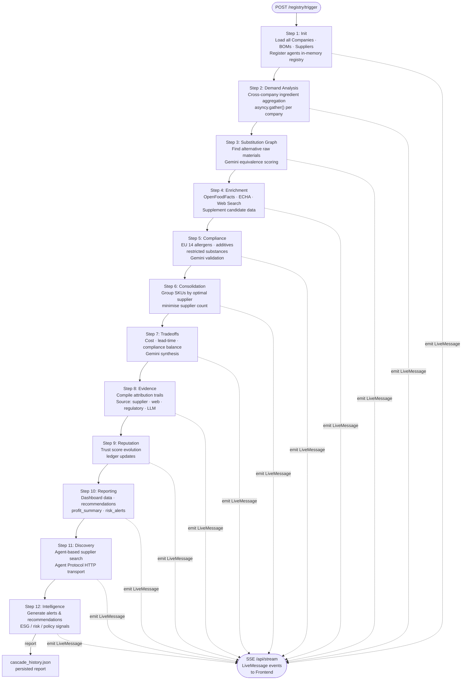
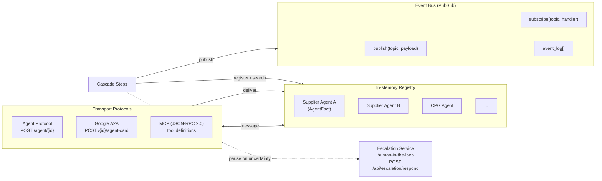

# Cascade Orchestration (Multi-Agent Supply Chain)

```mermaid
flowchart TD
    TRIG(["POST /registry/trigger"])
    INIT["Step 1: Init\nLoad all Companies · BOMs · Suppliers\nRegister agents in-memory registry"]
    DA["Step 2: Demand Analysis\nCross-company ingredient aggregation\nasyncy.gather() per company"]
    SUB["Step 3: Substitution Graph\nFind alternative raw materials\nGemini equivalence scoring"]
    ENR["Step 4: Enrichment\nOpenFoodFacts · ECHA · Web Search\nSupplement candidate data"]
    COM["Step 5: Compliance\nEU 14 allergens · additives\nrestricted substances\nGemini validation"]
    CON["Step 6: Consolidation\nGroup SKUs by optimal supplier\nminimise supplier count"]
    TRD["Step 7: Tradeoffs\nCost · lead-time · compliance balance\nGemini synthesis"]
    EV["Step 8: Evidence\nCompile attribution trails\nSource: supplier · web · regulatory · LLM"]
    REP["Step 9: Reputation\nTrust score evolution\nledger updates"]
    RPT["Step 10: Reporting\nDashboard data · recommendations\nprofit_summary · risk_alerts"]
    DIS["Step 11: Discovery\nAgent-based supplier search\nAgent Protocol HTTP transport"]
    INT["Step 12: Intelligence\nGenerate alerts & recommendations\nESG / risk / policy signals"]

    TRIG --> INIT --> DA --> SUB --> ENR --> COM --> CON --> TRD --> EV --> REP --> RPT --> DIS --> INT

    SSE(["SSE /api/stream\nLiveMessage events\nto Frontend"])
    HIST["cascade_history.json\npersisted report"]

    INT -->|report| HIST
    INIT & DA & SUB & ENR & COM & CON & TRD & EV & REP & RPT & DIS & INT -.->|emit LiveMessage| SSE
```

## Agent Registry & Messaging

```mermaid
graph LR
    subgraph Registry["In-Memory Registry"]
        AG1["Supplier Agent A\n(AgentFact)"]
        AG2["Supplier Agent B"]
        AG3["CPG Agent"]
        AGN["…"]
    end

    subgraph Protocols["Transport Protocols"]
        HTTP["Agent Protocol\nPOST /agent/{id}"]
        A2A["Google A2A\nPOST /{id}/agent-card"]
        MCP["MCP (JSON-RPC 2.0)\ntool definitions"]
    end

    subgraph Events["Event Bus (PubSub)"]
        PUB["publish(topic, payload)"]
        SUB2["subscribe(topic, handler)"]
        LOG["event_log[]"]
    end

    CAS["Cascade Steps"] -->|register / search| Registry
    CAS -->|publish| Events
    Events --> LOG
    Registry <-->|message| Protocols
    Protocols -->|deliver| Registry

    ESC["Escalation Service\nhuman-in-the-loop\nPOST /api/escalation/respond"]
    CAS -.->|pause on uncertainty| ESC
```