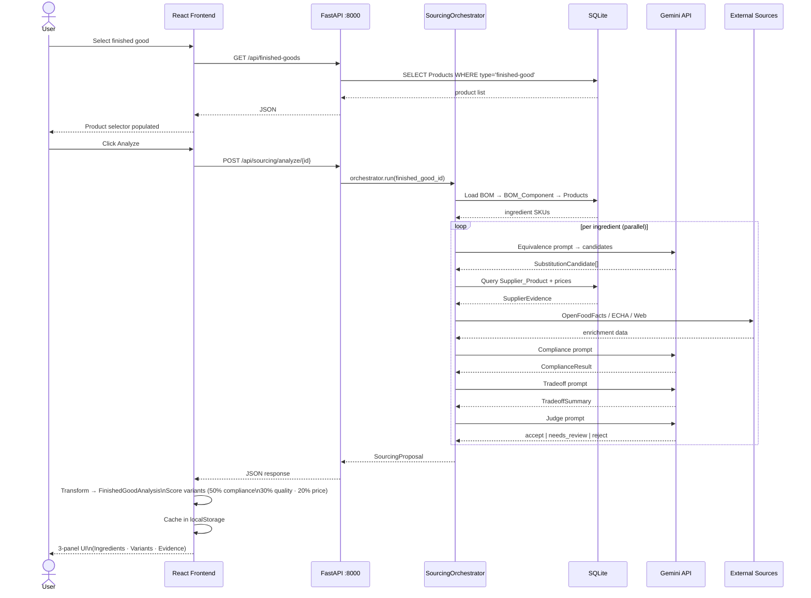
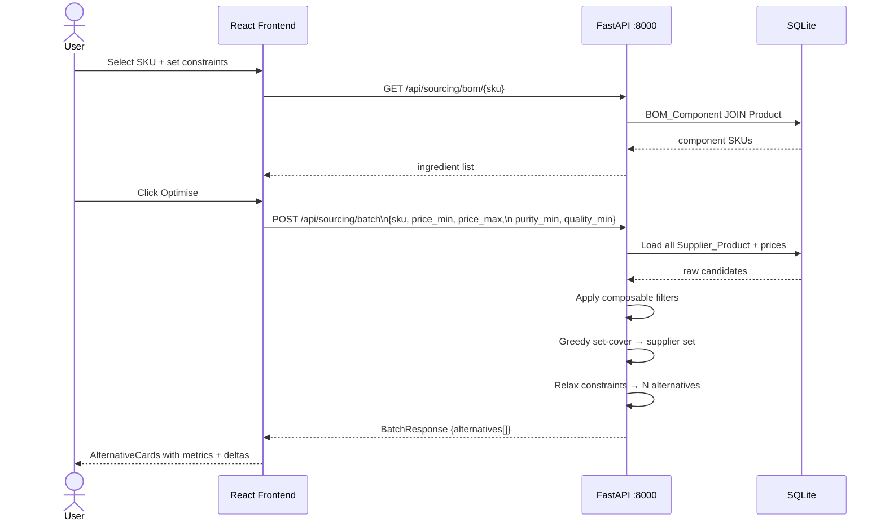

# End-to-End Data Flow

## Sourcing Analysis (Primary User Flow)

```mermaid
sequenceDiagram
    actor User
    participant FE as React Frontend
    participant API as FastAPI :8000
    participant ORC as SourcingOrchestrator
    participant DB as SQLite
    participant GEM as Gemini API
    participant EXT as External Sources

    User->>FE: Select finished good
    FE->>API: GET /api/finished-goods
    API->>DB: SELECT Products WHERE type='finished-good'
    DB-->>API: product list
    API-->>FE: JSON
    FE-->>User: Product selector populated

    User->>FE: Click Analyze
    FE->>API: POST /api/sourcing/analyze/{id}
    API->>ORC: orchestrator.run(finished_good_id)
    ORC->>DB: Load BOM → BOM_Component → Products
    DB-->>ORC: ingredient SKUs

    loop per ingredient (parallel)
        ORC->>GEM: Equivalence prompt → candidates
        GEM-->>ORC: SubstitutionCandidate[]
        ORC->>DB: Query Supplier_Product + prices
        DB-->>ORC: SupplierEvidence
        ORC->>EXT: OpenFoodFacts / ECHA / Web
        EXT-->>ORC: enrichment data
        ORC->>GEM: Compliance prompt
        GEM-->>ORC: ComplianceResult
        ORC->>GEM: Tradeoff prompt
        GEM-->>ORC: TradeoffSummary
        ORC->>GEM: Judge prompt
        GEM-->>ORC: accept | needs_review | reject
    end

    ORC-->>API: SourcingProposal
    API-->>FE: JSON response
    FE->>FE: Transform → FinishedGoodAnalysis\nScore variants (50% compliance\n30% quality · 20% price)
    FE->>FE: Cache in localStorage
    FE-->>User: 3-panel UI\n(Ingredients · Variants · Evidence)
```

## Batch Supplier Optimisation

```mermaid
sequenceDiagram
    actor User
    participant FE as React Frontend
    participant API as FastAPI :8000
    participant DB as SQLite

    User->>FE: Select SKU + set constraints
    FE->>API: GET /api/sourcing/bom/{sku}
    API->>DB: BOM_Component JOIN Product
    DB-->>API: component SKUs
    API-->>FE: ingredient list

    User->>FE: Click Optimise
    FE->>API: POST /api/sourcing/batch\n{sku, price_min, price_max,\n purity_min, quality_min}
    API->>DB: Load all Supplier_Product + prices
    DB-->>API: raw candidates
    API->>API: Apply composable filters
    API->>API: Greedy set-cover → supplier set
    API->>API: Relax constraints → N alternatives
    API-->>FE: BatchResponse {alternatives[]}
    FE-->>User: AlternativeCards with metrics + deltas
```