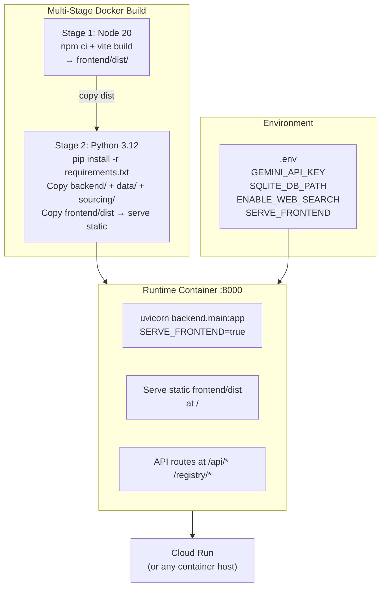
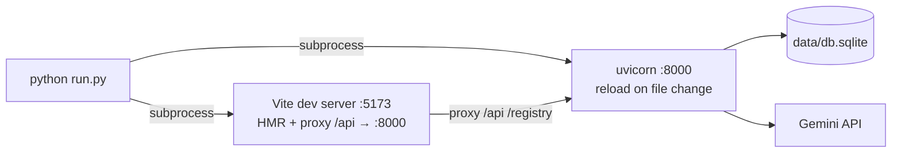
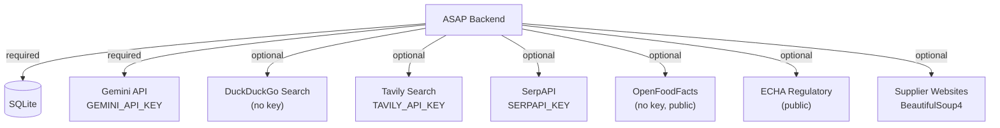

# Deployment Architecture

## Docker (Production)

```mermaid
flowchart TB
    subgraph Build["Multi-Stage Docker Build"]
        direction LR
        B1["Stage 1: Node 20\nnpm ci + vite build\n→ frontend/dist/"]
        B2["Stage 2: Python 3.12\npip install -r requirements.txt\nCopy backend/ + data/ + sourcing/\nCopy frontend/dist → serve static"]
    end

    subgraph Container["Runtime Container :8000"]
        UV["uvicorn backend.main:app\nSERVE_FRONTEND=true"]
        ST["Serve static frontend/dist\nat /"]
        API2["API routes at /api/* /registry/*"]
    end

    subgraph Config["Environment"]
        ENV[".env\nGEMINI_API_KEY\nSQLITE_DB_PATH\nENABLE_WEB_SEARCH\nSERVE_FRONTEND"]
    end

    B1 -->|copy dist| B2
    B2 --> Container
    ENV --> Container

    CR["Cloud Run\n(or any container host)"]
    Container --> CR
```

## Development

```mermaid
flowchart LR
    RUN["python run.py"]
    FEV["Vite dev server :5173\nHMR + proxy /api → :8000"]
    BEV["uvicorn :8000\nreload on file change"]

    RUN -->|subprocess| FEV
    RUN -->|subprocess| BEV

    FEV -- "proxy /api /registry" --> BEV
    BEV --> DB2[("data/db.sqlite")]
    BEV --> GEM2["Gemini API"]
```

## Service Dependencies

```mermaid
graph TD
    APP["ASAP Backend"] -->|required| DB3[("SQLite")]
    APP -->|required| GEM3["Gemini API\nGEMINI_API_KEY"]
    APP -->|optional| DDG["DuckDuckGo Search\n(no key)"]
    APP -->|optional| TAV["Tavily Search\nTAVILY_API_KEY"]
    APP -->|optional| SERP["SerpAPI\nSERPAPI_KEY"]
    APP -->|optional| OFF3["OpenFoodFacts\n(no key, public)"]
    APP -->|optional| ECHA3["ECHA Regulatory\n(public)"]
    APP -->|optional| SCRAPE["Supplier Websites\nBeautifulSoup4"]
```